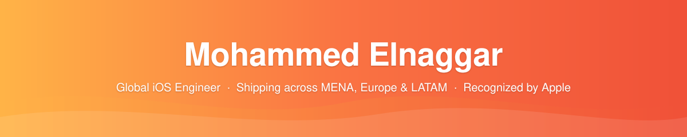

### Senior iOS Engineer @ **[Gathern Holding](https://gathern.co/en)** &nbsp;·&nbsp; ex-[CAFU](https://cafu.com), Vodafone

### Co-founder, **[SwiftCairo](https://github.com/SwiftCairo)** &nbsp;·&nbsp; Lead, **[Ameen app](https://ameenapp.org/)**

8+ years turning ambitious product ideas into iOS apps that ship to **millions of users**, across **three regions** (MENA, Europe & LATAM).

 

---

## 👋 Hi, I'm Mohammed

I help product teams ship iOS apps that are **fast, reliable, and loved by users**, wherever in the world they live. I've led iOS engineering at a hospitality unicorn in KSA ([Gathern](https://gathern.co/en)), the Middle East's largest fuel-delivery platform ([CAFU](https://cafu.com)), a multinational telco operating across Europe (Vodafone), and a Budapest-based product agency serving LATAM clients. On the side, I co-founded **[SwiftCairo](https://github.com/SwiftCairo)**, Egypt's largest iOS community, and lead the iOS team at **[Ameen](https://ameenapp.org/)**, building faith-tech that serves Muslims worldwide.

I care equally about the product, the people building it, and the code underneath.

---

## 🏅 Recognized by Apple

> *"iOS engineer and educator. Builds scalable mobile experiences used by millions throughout the Middle East and North Africa. Co-founder of SwiftCairo, one of the region's most active iOS communities, leading through events, webinars, and technical sessions, and creating educational content to make high-quality iOS development knowledge more widely accessible."*
>
> Source: [**Apple Developer Community Recognition**](https://developer.apple.com/community/recognition/#mohammed-elnaggar)

---

## 📊 By the numbers

| 🌙 2M+ | 🏨 Millions | 🌍 3 | 🚀 8+ | 📦 40% | 👥 90+ |
|:---:|:---:|:---:|:---:|:---:|:---:|
| Ramadan users on [Ameen](https://ameenapp.org/) | Guests on [Gathern](https://gathern.co/en) | Regions shipped to | Years building iOS | App-size reduction | Mentoring sessions |

> Numbers from real production work at [CAFU](https://cafu.com), VOIS/Vodafone, [Gathern](https://gathern.co/en), [Ameen](https://ameenapp.org/), and [SwiftCairo](https://github.com/SwiftCairo) (2018 to present).

---

## 🧭 What I'm doing now

<table>
<tr><td width="50%" valign="top">

### 🏨 [Gathern Holding](https://gathern.co/en) &nbsp;·&nbsp; *Senior iOS Engineer*
**2026 → now &nbsp;·&nbsp; Riyadh / Remote**

Building the iOS experience for KSA's leading peer-to-peer vacation-rental platform. Chalets, farms, villas, and short-stay rentals trusted by **millions of guests** across the Kingdom.

`Swift` &nbsp; `SwiftUI` &nbsp; `Modular SPM` &nbsp; `CI/CD`

</td><td width="50%" valign="top">

### 🧡 [SwiftCairo](https://github.com/SwiftCairo) &nbsp;·&nbsp; *Co-founder & Mentor*
**2018 → now &nbsp;·&nbsp; Cairo**

Egypt's largest iOS community. Meetups, workshops, the [SwiftCairo YouTube](https://www.youtube.com/swiftcairo) show with global iOS devs, and 1:1 mentorship into iOS careers.

[github.com/SwiftCairo](https://github.com/SwiftCairo) &nbsp;·&nbsp; 80★ on session archives

</td></tr>
</table>

---

## 🕌 Faith-tech: building for the Ummah

Technology that serves Muslims worldwide is a personal mission, not a side gig. I lead the iOS team at **[Ameen](https://ameenapp.org/)**, a comprehensive Islamic lifestyle app combining **Quran, prayer times, dhikr, Zakat & Islamic finance,** and broader spiritual tools in one place.

<table>
<tr><td width="60%" valign="top">

### 📱 [Ameen](https://ameenapp.org/) &nbsp;·&nbsp; *Lead iOS Engineer*

> An all-in-one companion for Muslim daily life: Quran reading, accurate prayer times & qibla, dhikr / adhkar, Zakat calculation and halal-finance tools, plus learning content.

🌙 **Reached 2M+ users during Ramadan.** Peak-traffic scale meets spiritually meaningful UX.

Built with the same engineering rigor I bring to commercial products: clean architecture, modular SPM, privacy-first analytics, and respectful, low-distraction UX.

`Swift` &nbsp; `SwiftUI` &nbsp; `Modular SPM` &nbsp; `Privacy-first`

</td><td width="40%" valign="top">

### 🕌 [SalahBreak](https://github.com/salahbreak/salahbreak) &nbsp;·&nbsp; *Creator & Maintainer*

My own prayer-companion app spanning the **entire Apple ecosystem**: iPhone, iPad, Apple Watch, macOS, CarPlay, and Home Screen widgets. Built solo as a labor of love, partly to push myself across every Apple platform, and partly to give the community something thoughtful and free.

`iOS` &nbsp; `watchOS` &nbsp; `iPadOS` &nbsp; `macOS` &nbsp; `CarPlay` &nbsp; `WidgetKit`

🤲 *More Islamic-tech experiments in the works. DM me if you're building in this space.*

</td></tr>
</table>

> *Building for the Ummah is the work I'm proudest of. If you're building a product that serves Muslims and you care about doing it right, let's talk.*

---

## 💼 Where I've shipped before

<b>📂 Click to expand: highlights from each role</b>

### 🚗 [CAFU](https://cafu.com) &nbsp;·&nbsp; Senior iOS Engineer &nbsp;·&nbsp; *2023 to 2026*
> The Middle East's largest fuel-delivery & vehicle-services platform.

- **Modernized the legacy iOS app**: cut bundle size by **40%** through modularization and asset strategy.
- **Rebuilt the release pipeline** on Fastlane + signed CI, **60%** faster, near-zero manual steps.
- **Architected a modular SPM-based system** so feature teams could ship independently.
- **Integrated Apple Pay** and multiple B2B payment gateways for the GCC market.
- **Wired up the analytics stack** (Amplitude, CleverTap, MetricKit) used for every product decision.

### 📡 VOIS / Vodafone &nbsp;·&nbsp; Senior iOS Engineer &nbsp;·&nbsp; *2022 to 2023*
> Vodafone Intelligent Solutions, MarTech Lab, multi-country.

- Performance work across Vodafone's digital iOS surface.
- Built MVA10 data architecture with Tealium for cross-market analytics.
- Cross-functional with squads in the UK, Italy, and Germany.

### 🎨 Very Creatives &nbsp;·&nbsp; iOS Engineer &nbsp;·&nbsp; *2020 to 2022*
> Boutique product agency, Budapest.

- Led the iOS chapter for *Krush Brands*.
- Designed the agency's Agile CI/CD playbook for client work.

---

## 🛠 Selected open source

<table>
<tr>
<td width="33%" valign="top">

#### 🪵 [SwiftMoLogger](https://github.com/MoElnaggar14/SwiftMoLogger)
Production-grade iOS logging with **MetricKit crash reporting**, 40+ tags, zero dependencies.

`Swift` · `MetricKit` · `SPM`

</td>
<td width="33%" valign="top">

#### 🔐 [SwiftPermissions](https://github.com/MoElnaggar14/SwiftPermissions)
Modern iOS permissions with **async/await**, Combine, and ready-made SwiftUI views.

`Swift Concurrency` · `Combine` · `SwiftUI`

</td>
<td width="33%" valign="top">

#### 🕌 [SalahBreak](https://github.com/salahbreak/salahbreak)
Prayer companion across **iOS, iPadOS, watchOS, macOS, CarPlay** + widgets. Built solo for the community.

`iOS` · `watchOS` · `CarPlay` · `WidgetKit`

</td>
</tr>
<tr>
<td width="33%" valign="top">

#### ☕ [Caffeine](https://github.com/MoElnaggar14/Caffeine)
A modern macOS take on the classic Caffeine utility.

`macOS` · `SwiftUI`

</td>
<td width="33%" valign="top">

#### 🎙 [SwiftCairo MeetupSessions](https://github.com/SwiftCairo/MeetupSessions)
Code, slides & videos from every SwiftCairo meetup. **80★**.

`Community` · `Talks`

</td>
<td width="33%" valign="top">

#### 🧠 [iOS Agent Skills](https://github.com/MoElnaggar14/iOS-development-agent-skills)
Reusable Codex/Claude skills for iOS dev & localization.

`AI tooling` · `iOS workflows`

</td>
</tr>
</table>

---

## 🧰 What I work with

**Languages** &nbsp;·&nbsp; Swift, Objective-C  
**UI** &nbsp;·&nbsp; SwiftUI, UIKit, Combine, Swift Concurrency  
**Architecture** &nbsp;·&nbsp; Clean Architecture, MVVM, TCA, Modular SPM, Coordinators  
**Apple platform** &nbsp;·&nbsp; Apple Pay, StoreKit, Core Bluetooth, NFC, MetricKit, Sparkle (macOS)  
**Delivery** &nbsp;·&nbsp; Fastlane, GitHub Actions, Bitrise, signed pipelines, TestFlight  
**Product data** &nbsp;·&nbsp; Amplitude, CleverTap, Firebase, Tealium  
**Markets** &nbsp;·&nbsp; Arabic & English localization, GCC payment ecosystems

---

## 🎙 Community & speaking

- **Co-founder, [SwiftCairo](https://github.com/SwiftCairo)** *(2018 → now)*. Egypt's largest iOS community.
- **Mentor.** +100 sessions on [ADPList](https://adplist.org/mentors/mohammed-elnaggar), informally through SwiftCairo, helping developers grow into iOS roles.
- **Host, [SwiftCairo on YouTube](https://www.youtube.com/swiftcairo).** Interviews and live sessions with iOS engineers from around the world.
- **Writer, [moelnaggar14.substack.com](https://moelnaggar14.substack.com).** Notes on iOS engineering, architecture, and community.
- **Speaker.** Talks on clean architecture, performance, and shipping in regulated markets.

> Want me to speak at your event or run a workshop? [Email me](mailto:moelnaggar14@gmail.com).

---

## 💬 Let's talk about

🚀 **Hiring senior iOS talent** &nbsp;·&nbsp; 🧱 **Architecture audits** &nbsp;·&nbsp; 🌍 **Going global from MENA** &nbsp;·&nbsp; 🕌 **Faith-tech & Islamic services** &nbsp;·&nbsp; 🎤 **SwiftCairo collabs**

&nbsp;

✨ <i>From mobile user to iOS engineer, building things I'd want to use.</i>

